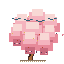
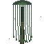
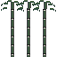

# Pixel Asset Master — AI generates 2D pixel game assets from game design briefs

[](#)
[](https://opensource.org/licenses/MIT)
[](https://www.python.org/)

English | [中文](./README_CN.md)

Drop in a game concept, art direction, or reference images — get back a structured pixel asset project with sprites, tiles, items, UI, effects, backgrounds, animation frames, sprite sheets, and export metadata.

我是一名对游戏独立开发感兴趣的大学生，这个项目的灵感来自 PPT-master。它尝试把“用结构化流程辅助创作”的思路迁移到 2D 游戏像素素材生成中，让独立开发者可以更快整理美术方向、生成素材，并保留可复用的项目规范。

## Project Example

下面是一个水墨工笔像素风项目示例，包含两种树与竹子的动画展示。

| Asset | Preview | Frames |
|-------|---------|--------|
| Cherry Blossom Tree |  | 6-frame sprite sheet |
| Willow Tree |  | 6-frame sprite sheet |
| Bamboo |  | 4-frame sprite sheet |

> **How it works** — Pixel Asset Master is a workflow skill for AI IDEs. You chat with an AI agent, confirm the style constraints, and the skill guides the agent through project setup, asset planning, generation, validation, and export.

> **Local-first workflow** — Project files and generated assets are stored locally under `projects/`. API usage only depends on whatever AI tool or image provider you choose to connect.

Pixel Asset Master focuses on:

- **Game-ready structure** — assets are grouped by `characters`, `tiles`, `items`, `ui`, `effects`, and `backgrounds`.
- **Strict visual contract** — `spec_lock.md` records canvas size, palette, style, color budget, and forbidden rendering patterns.
- **Reusable templates** — built-in palettes, size presets, and sprite layout references.
- **Validation tools** — scripts help check palette compliance, color budget, image format, and sprite sheet export.
- **Agent-friendly process** — staged confirmations reduce vague prompts and keep long asset runs consistent.

---

## Quick Start

### 1. Prerequisites

| Dependency | Required? | What it does |
|------------|:---------:|--------------|
| Python 3.8+ | ✅ Yes | Runs the helper scripts |
| Pillow | ✅ Yes | Image analysis, validation, quantization, and sprite sheet packing |

Install the CLI tool with [uv](https://docs.astral.sh/uv/):

```bash
uv tool install .
```

This installs the `pam` (and `pixel-asset-master`) command globally. If you prefer to run without installing, use `uv run pam ...` from the repository root.

### 2. Set Up

**Option A — Download ZIP**: download the repository ZIP from GitHub and unzip it.

**Option B — Git clone**:

```bash
git clone <your-repository-url>
cd pixel-asset-master-skills
uv tool install .
```

### 3. Put It Into Your AI Coding IDE

After downloading or unzipping the repository, open the **entire `pixel-asset-master-skills/` folder** as a workspace in your AI coding IDE.

| IDE | How to use |
|-----|------------|
| **Cursor** | `File → Open Folder...` and select `pixel-asset-master-skills/`. Ask the chat agent to read `skills/pixel-asset-master/SKILL.md`. |
| **Trae** | Open the folder as a project/workspace. Then mention `skills/pixel-asset-master/SKILL.md` in chat before asking for assets. |
| **Windsurf** | Open the folder in Windsurf. Use Cascade chat and reference `skills/pixel-asset-master/SKILL.md` when starting a pixel asset task. |
| **Other AI coding IDEs** | Open the repository root as the workspace and point the agent to `skills/pixel-asset-master/SKILL.md`. |

Recommended first prompt:

```text
Read skills/pixel-asset-master/SKILL.md and help me create a pixel art asset project.
```

### 4. Create a Pixel Asset Project

```bash
pam init demo --size 32x32 --palette DB32
```

The generated project is saved under `projects/` and is ignored by Git by default.

### 5. Choose Your Generation Mode

#### Mode A — Without Reference Images

Use this when you only have a text idea, game design brief, or art direction.

Example prompt:

```text
Read skills/pixel-asset-master/SKILL.md.
Create a 64x64 4-direction RPG character sprite sheet.
Style: ink-wash gongbi pixel art.
Actions: idle and walk.
No reference image.
```

The agent should:

1. Confirm style, size, palette, facing direction, action list, and frame count.
2. Create or update `projects/<project_name>/design_spec.md`.
3. Create or update `projects/<project_name>/spec_lock.md`.
4. Generate PNG assets, animation frames, sprite sheets, and manifests.

#### Mode B — With Reference Images

Use this when you already have character art, tiles, UI mockups, moodboards, or screenshots that should guide the generated pixel art.

First, import reference images:

```bash
pam import-sources projects/demo_32x32_YYYYMMDD path/to/reference.png
```

Then prompt the AI agent:

```text
Read skills/pixel-asset-master/SKILL.md.
Use the images under projects/demo_32x32_YYYYMMDD/images/ as visual references.
Generate matching pixel art assets and keep the same silhouette, palette mood, and style constraints.
```

The agent should analyze the reference images, derive style and palette constraints, then continue through the same spec lock, generation, validation, and export pipeline.

### 6. Validate and Export

```bash
pam validate-project projects/demo_32x32_YYYYMMDD
pam validate-assets projects/demo_32x32_YYYYMMDD
pam finalize projects/demo_32x32_YYYYMMDD --all
pam sheet projects/demo_32x32_YYYYMMDD --by-category
```

> **AI lost context?** Ask it to read `skills/pixel-asset-master/SKILL.md`.

---

## Repository Layout

```text
.
├── pyproject.toml
├── uv.lock
├── src/
│   └── pixel_asset_master/      # Installable Python package / CLI
├── skills/
│   └── pixel-asset-master/
│       ├── SKILL.md
│       ├── references/
│       ├── scripts/
│       │   └── README.md        # CLI command reference
│       ├── templates/
│       └── workflows/
└── projects/                    # Generated asset projects (ignored by Git)
```

## Documentation

| | Document | Description |
|---|----------|-------------|
| 📖 | [SKILL.md](./skills/pixel-asset-master/SKILL.md) | Core workflow and execution rules |
| 🛠️ | [CLI Reference](./skills/pixel-asset-master/scripts/README.md) | `pam` command usage and examples |
| 🏗️ | [Project Structure](./docs/PROJECT_STRUCTURE.md) | Repository structure and generated-content boundaries |
| 🤝 | [Contributing](./CONTRIBUTING.md) | Contribution scope and workflow |
| 🔐 | [Security](./SECURITY.md) | Vulnerability reporting and scope |

## What Should Not Be Committed

- **Generated projects**: `projects/`
- **Export packages**: `exports/`, `*.zip`, `*.tar.gz`
- **Secrets**: `.env`, real API keys, tokens, private account data

## Contributing

See [CONTRIBUTING.md](./CONTRIBUTING.md) for how to get involved.

## License

[MIT](LICENSE)

[⬆ Back to Top](#pixel-asset-master--ai-generates-2d-pixel-game-assets-from-game-design-briefs)
